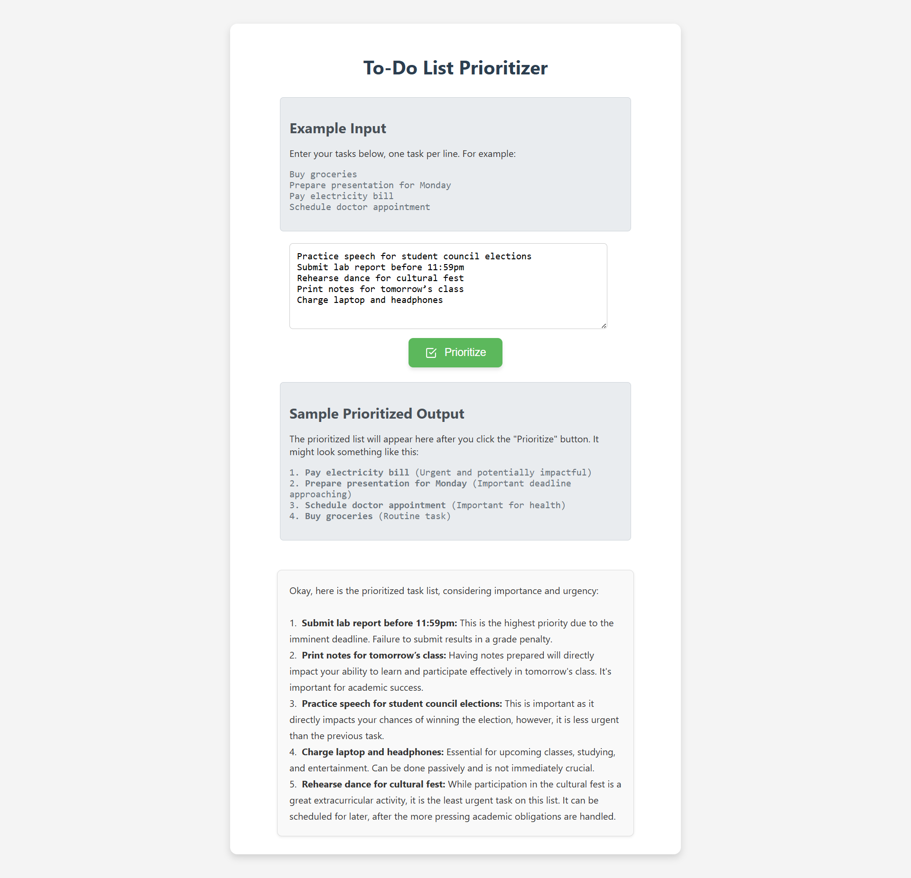

# 📝 To-Do List Prioritizer

A sleek and smart web app that helps you **prioritize your tasks** using Google's **Gemini 2.0 Flash API**. Just list your tasks and get a prioritized to-do list based on urgency and importance — all within your browser.

---

## 🚀 Features

- ✅ Clean and responsive UI with smooth animations
- 🧠 Smart task prioritization using Gemini AI
- 🔒 Works with your own API key (no backend needed)
- 🖼️ Example input and output provided
- 💡 Instant feedback and error handling

---

## 📸 Screenshot

---

## ✨ Demo

Just open the `To_DO_List_Prioritizer.html` file in your browser and start prioritizing!

---

## 🧪 Example

**Input:**

Attend physics lecture at 10am    

Take a 30-minute walk   

Review lecture slides from yesterday   

Backup important documents    

Submit weekly discussion post 

**Output:**

Okay, here's a prioritized list of your tasks based on importance and urgency:

1.  Attend physics lecture at 10 am: This is likely the most important and urgent task. Lectures are time-sensitive and provide essential information you can't get elsewhere. Missing it could negatively impact your understanding of the course material and your grade.

2.  Submit weekly discussion post: Discussion posts often have deadlines, so this needs to be addressed soon. It's important for your grade and participation in the course.

3.  Backup important documents: Data loss can be devastating. This task is important to prevent that and should be done regularly. I've prioritized it higher than reviewing the lecture because data loss can cause more problems than waiting on a lecture review.

4.  Review lecture slides from yesterday: Reviewing slides is beneficial for reinforcing knowledge. Doing it sooner rather than later helps with retention.

5.  Take a 30-minute walk: While beneficial for physical and mental health, this is the least urgent task. It can be fit in around the other tasks.

Important Considerations:

*   Personal Deadlines: Adjust the priorities if you have a personal deadline for any of these tasks that's earlier than implied (e.g., the discussion post is due *tonight*).
*   Context: Your individual learning style and the specifics of your courses might slightly shift the priority of the academic tasks. For example, if your discussion post is simple and quick, you might prioritize the lecture review first.

Good luck with your day!
